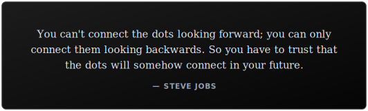

Hi, I'm Ankit. I'm a software engineer who likes to build things end-to-end — from real-time backends to the UI on top of them. Currently exploring AI, LLMs, and agentic systems. 
Former SDE intern at [`Kim`](https://kim.cc).

Reach me: [`Email`](mailto:ankit.ku3101@gmail.com) [`LinkedIn`](https://linkedin.com/in/ankit-kumar-25aa53134) [`Portfolio`](https://ankit31.me)

  

<!--
**ankitku3101/ankitku3101** is a ✨ _special_ ✨ repository because its `README.md` (this file) appears on your GitHub profile.
-->
